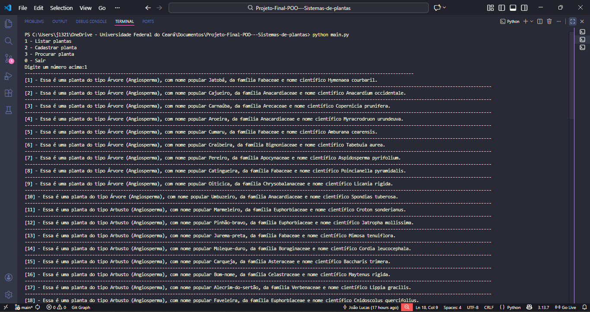
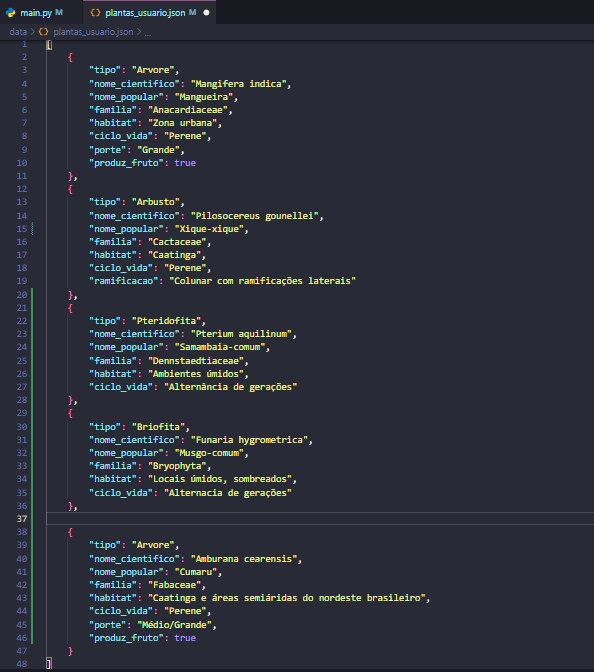
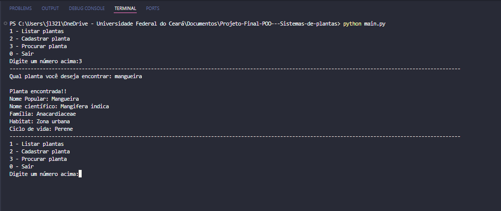
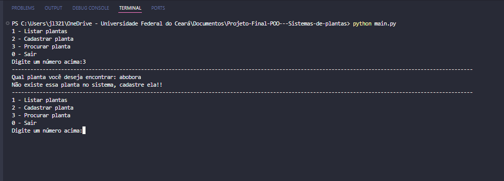
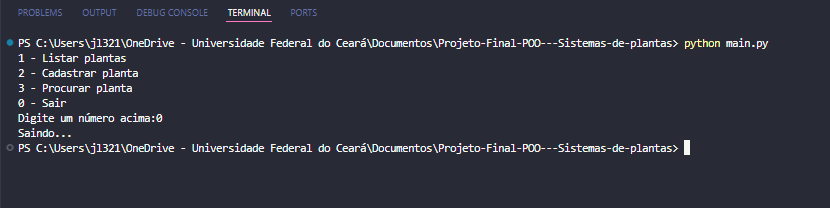

# Sistema de Plantas - POO  
Este é projeto acadêmico desenvolvido para a disciplina **Programação Orientada a Objetos**. O sistema consiste em aplicar os conceitos estudados `Polimorfismo`, `Abstração`, `Herança` e `Encapsulamento` e boas práticas.

## Funcionalidades do sistema

O sistema oferece três operações principais:  
1. **Listar plantas:** Exibe todas as plantas cadastradas, informando o tipo, nome popular, familia e o nome cientifico.
2. **Cadastrar planta:** Permite que o usuário insira novas plantas, e o salvamento automático no `plantas_usuario.json`.
3. **Procurar planta:** Permite que o usuário realize uma busca no banco de dados local, para encontar uma planta em espeficifa.

## Tecnologias e conceitos de POO  
Linguagem: `Python`
Persistência: `JSON(JavaScript Object Notation)`
## Conceitos aplicados  

- Abstração
- Polimorfismo
- Herança
- Encapsulamento

# Estrutura do Projeto
A organização dos arquivos segue o padrão abaixo:
```text
    |--data/
        |-- plantas_ceara.py
        |-- plantas_usuario.json
    |--images
        |-
    |--models/
        |-- angiosperma.py
        |-- arbusto.py
        |-- arvore.py
        |-- briofita.py
        |-- gimnosperma.py
        |-- herbacea.py
        |-- planta.py
        |-- pteridofita.py
    |--uml
        |--Diagrama UML - Sistema de Plantas.png
    |--main.py
    |--README.md
    |--gitignore  

```
## Diagrama UML  
 
  

# Resultados obtidos  
Alguns prints da Execução do programa

1. **Listar plantas**: Aqui é onde é listado todas as plantas cadastradas no sistema.  
 

2. **Cadastrar planta**: Aqui você escolhe o tipo de planta que você quer cadastrar por exemplo nesse caso escolhi uma planta do tipo `Arvore`, mas você pode escolher essas outras opções como exemplificada na imagem abaixo (obs: Você também pode escolher pelo indice que aparece na frente do tipo de árvore que quer cadastrar):  

  

Após o cadastro, irá  armazeanar a planta no arquivo `plantas_usuario.json`. 



3. **Procurar planta**: Nessa funcionalidade você procura as planta se a planta que o usuário está procurando irá aparecer um mensagem de `Planta encontrada!` e uma `Descrição` da planta mais objetiva.  



caso não tenha a planta cadastrada no Banco de Dados local,irá aparecer uma mensagem de `Planta não encontrada`, e vai sugerir para você cadastrar a planta.



4. **Sair**: Esse é um comando para sair do sistema.



### Passo a Passo
1. **Clone ou baixe** este repositório para sua máquina.
2. Abra a pasta do projeto no **VS Code**.
3. Certifique-se de que o arquivo `arquivo.json` está na raiz do projeto (ou dentro da pasta `data/`).
4. Abra o terminal integrado do VS Code (`Ctrl + '` ou `Terminal > New Terminal`).
5. Execute o comando:
   ```bash
   python main.py

**Autor:** João Lucas Pinto Taveira  
**Disciplina:** Programação Orientada a Objetos  
**Instituição:** Universidade Federal do Ceará (UFC) 